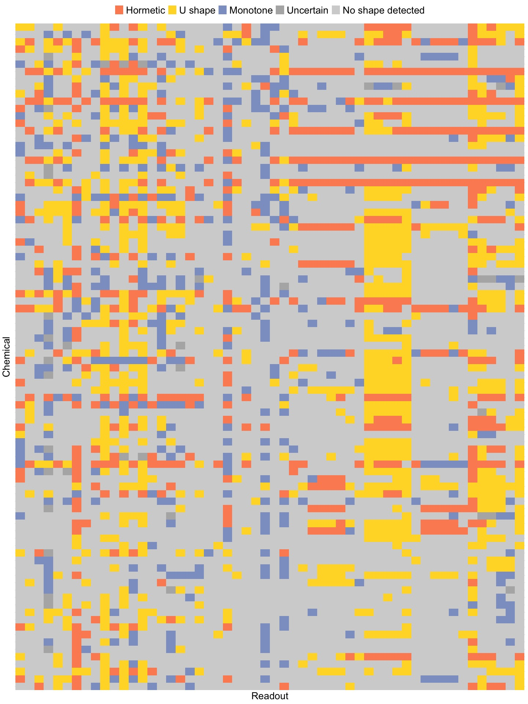
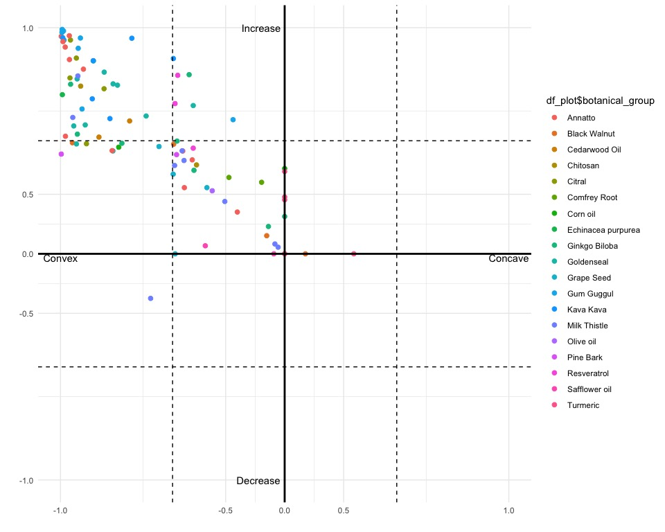
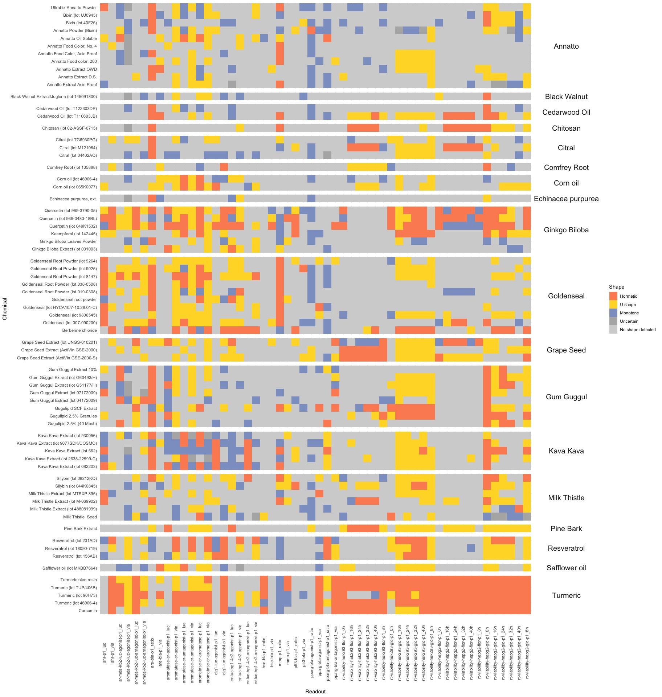
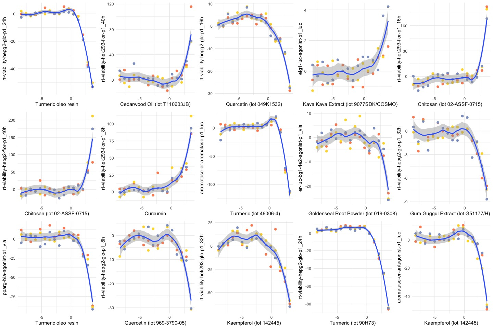
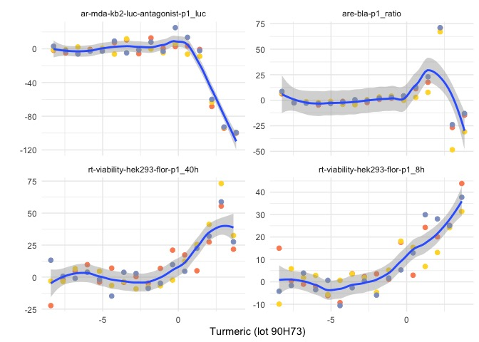
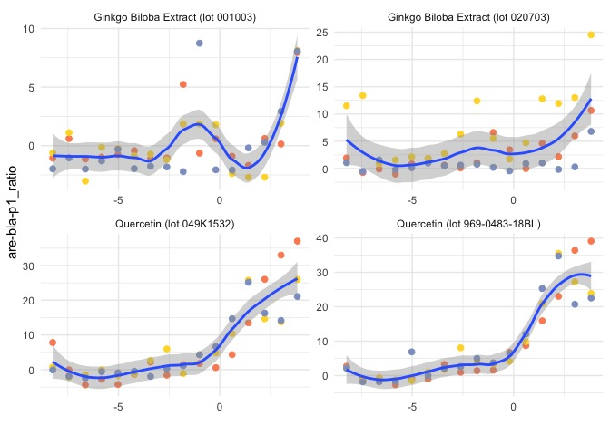

```
## Joining with `by = join_by(sample_id)`
```


# Overall summarization


```
## 
##          Hormetic           U shape          Monotone         Uncertain 
##               562               822               392                38 
## No shape detected 
##              3046
```

<!-- -->


## Scatterplot example of one assay


```
## Joining with `by = join_by(sample_id)`
```

<!-- -->

# Hormesis curves

<!-- -->

## Table summary by botanical group (chemical) 

<table class="table" style="color: black; width: auto !important; margin-left: auto; margin-right: auto;">
<caption>Number of dose-response curves identified as hormesis, and percentage of hormesis curves out of all dose-reponse curves in each botanical group.</caption>
 <thead>
  <tr>
   <th style="text-align:left;"> Botanical Group </th>
   <th style="text-align:center;"> N (pct) </th>
  </tr>
 </thead>
<tbody>
  <tr>
   <td style="text-align:left;"> Turmeric </td>
   <td style="text-align:center;"> 158 (58.52%) </td>
  </tr>
  <tr>
   <td style="text-align:left;"> Ginkgo Biloba </td>
   <td style="text-align:center;"> 91 (18.72%) </td>
  </tr>
  <tr>
   <td style="text-align:left;"> Goldenseal </td>
   <td style="text-align:center;"> 65 (12.04%) </td>
  </tr>
  <tr>
   <td style="text-align:left;"> Gum Guggul </td>
   <td style="text-align:center;"> 53 (12.27%) </td>
  </tr>
  <tr>
   <td style="text-align:left;"> Kava Kava </td>
   <td style="text-align:center;"> 39 (12.04%) </td>
  </tr>
  <tr>
   <td style="text-align:left;"> Milk Thistle </td>
   <td style="text-align:center;"> 29 (5.97%) </td>
  </tr>
  <tr>
   <td style="text-align:left;"> Resveratrol </td>
   <td style="text-align:center;"> 28 (17.28%) </td>
  </tr>
  <tr>
   <td style="text-align:left;"> Grape Seed </td>
   <td style="text-align:center;"> 24 (11.11%) </td>
  </tr>
  <tr>
   <td style="text-align:left;"> Annatto </td>
   <td style="text-align:center;"> 21 (3.24%) </td>
  </tr>
  <tr>
   <td style="text-align:left;"> Citral </td>
   <td style="text-align:center;"> 13 (4.81%) </td>
  </tr>
  <tr>
   <td style="text-align:left;"> Cedarwood Oil </td>
   <td style="text-align:center;"> 12 (11.11%) </td>
  </tr>
  <tr>
   <td style="text-align:left;"> Chitosan </td>
   <td style="text-align:center;"> 12 (11.11%) </td>
  </tr>
  <tr>
   <td style="text-align:left;"> Pine Bark </td>
   <td style="text-align:center;"> 6 (5.56%) </td>
  </tr>
  <tr>
   <td style="text-align:left;"> Corn oil </td>
   <td style="text-align:center;"> 5 (4.63%) </td>
  </tr>
  <tr>
   <td style="text-align:left;"> Comfrey Root </td>
   <td style="text-align:center;"> 2 (1.85%) </td>
  </tr>
  <tr>
   <td style="text-align:left;"> Safflower oil </td>
   <td style="text-align:center;"> 2 (1.85%) </td>
  </tr>
  <tr>
   <td style="text-align:left;"> Black Walnut </td>
   <td style="text-align:center;"> 1 (0.37%) </td>
  </tr>
  <tr>
   <td style="text-align:left;"> Echinacea purpurea </td>
   <td style="text-align:center;"> 1 (1.85%) </td>
  </tr>
  <tr>
   <td style="text-align:left;"> Olive oil </td>
   <td style="text-align:center;"> 0 (0%) </td>
  </tr>
</tbody>
</table>

## Table summary by assays


<table class="table" style="color: black; width: auto !important; margin-left: auto; margin-right: auto;">
<caption>Number of dose-response curves identified as hormesis, and percentage of hormesis curves out of all dose-reponse curves of each assay in each channel.</caption>
 <thead>
  <tr>
   <th style="text-align:left;"> Assay </th>
   <th style="text-align:left;"> luc </th>
   <th style="text-align:left;"> via </th>
  </tr>
 </thead>
<tbody>
  <tr>
   <td style="text-align:left;"> ahr-p1 </td>
   <td style="text-align:left;"> 16 (17.78%) </td>
   <td style="text-align:left;"> 10 (11.11%) </td>
  </tr>
  <tr>
   <td style="text-align:left;"> ar-mda-kb2-luc-agonist-p1 </td>
   <td style="text-align:left;"> 9 (10%) </td>
   <td style="text-align:left;"> 1 (1.11%) </td>
  </tr>
  <tr>
   <td style="text-align:left;"> ar-mda-kb2-luc-antagonist-p1 </td>
   <td style="text-align:left;"> 11 (12.22%) </td>
   <td style="text-align:left;"> 3 (3.33%) </td>
  </tr>
  <tr>
   <td style="text-align:left;"> aromatase-er-agonist-p1 </td>
   <td style="text-align:left;"> 9 (10%) </td>
   <td style="text-align:left;"> 8 (8.89%) </td>
  </tr>
  <tr>
   <td style="text-align:left;"> aromatase-er-antagonist-p1 </td>
   <td style="text-align:left;"> 18 (20%) </td>
   <td style="text-align:left;"> 5 (5.56%) </td>
  </tr>
  <tr>
   <td style="text-align:left;"> aromatase-er-aromatase-p1 </td>
   <td style="text-align:left;"> 20 (22.22%) </td>
   <td style="text-align:left;"> 8 (8.89%) </td>
  </tr>
  <tr>
   <td style="text-align:left;"> elg1-luc-agonist-p1 </td>
   <td style="text-align:left;"> 7 (7.78%) </td>
   <td style="text-align:left;"> 13 (14.44%) </td>
  </tr>
  <tr>
   <td style="text-align:left;"> er-luc-bg1-4e2-agonist-p1 </td>
   <td style="text-align:left;"> 7 (7.78%) </td>
   <td style="text-align:left;"> 4 (4.44%) </td>
  </tr>
  <tr>
   <td style="text-align:left;"> er-luc-bg1-4e2-antagonist-p1 </td>
   <td style="text-align:left;"> 7 (7.78%) </td>
   <td style="text-align:left;"> 3 (3.33%) </td>
  </tr>
</tbody>
</table>
<table class="table" style="color: black; width: auto !important; margin-left: auto; margin-right: auto;">
<caption>Number of dose-response curves identified as hormesis, and percentage of hormesis curves out of all dose-reponse curves of each assay in each channel.</caption>
 <thead>
  <tr>
   <th style="text-align:left;"> Assay </th>
   <th style="text-align:left;"> ratio </th>
   <th style="text-align:left;"> via </th>
  </tr>
 </thead>
<tbody>
  <tr>
   <td style="text-align:left;"> are-bla-p1 </td>
   <td style="text-align:left;"> 39 (43.33%) </td>
   <td style="text-align:left;"> 4 (4.44%) </td>
  </tr>
  <tr>
   <td style="text-align:left;"> hse-bla-p1 </td>
   <td style="text-align:left;"> 4 (4.44%) </td>
   <td style="text-align:left;"> 1 (1.11%) </td>
  </tr>
  <tr>
   <td style="text-align:left;"> mmp-p1 </td>
   <td style="text-align:left;"> 23 (25.56%) </td>
   <td style="text-align:left;"> 3 (3.33%) </td>
  </tr>
  <tr>
   <td style="text-align:left;"> p53-bla-p1 </td>
   <td style="text-align:left;"> 6 (6.67%) </td>
   <td style="text-align:left;"> 1 (1.11%) </td>
  </tr>
  <tr>
   <td style="text-align:left;"> pparg-bla-agonist-p1 </td>
   <td style="text-align:left;"> 2 (2.22%) </td>
   <td style="text-align:left;"> 8 (8.89%) </td>
  </tr>
  <tr>
   <td style="text-align:left;"> pparg-bla-antagonist-p1 </td>
   <td style="text-align:left;"> 6 (6.67%) </td>
   <td style="text-align:left;"> 9 (10%) </td>
  </tr>
</tbody>
</table>

<table class="table" style="color: black; width: auto !important; margin-left: auto; margin-right: auto;">
<caption>Number of dose-response curves identified as hormesis, and percentage of hormesis curves out of all dose-reponse curves of each assay at each time.</caption>
 <thead>
  <tr>
   <th style="text-align:left;"> Assay </th>
   <th style="text-align:left;"> 0h </th>
   <th style="text-align:left;"> 16h </th>
   <th style="text-align:left;"> 24h </th>
   <th style="text-align:left;"> 32h </th>
   <th style="text-align:left;"> 40h </th>
   <th style="text-align:left;"> 8h </th>
  </tr>
 </thead>
<tbody>
  <tr>
   <td style="text-align:left;"> rt-viability-hek293-flor-p1 </td>
   <td style="text-align:left;"> 9 (10%) </td>
   <td style="text-align:left;"> 9 (10%) </td>
   <td style="text-align:left;"> 10 (11.11%) </td>
   <td style="text-align:left;"> 11 (12.22%) </td>
   <td style="text-align:left;"> 13 (14.44%) </td>
   <td style="text-align:left;"> 9 (10%) </td>
  </tr>
  <tr>
   <td style="text-align:left;"> rt-viability-hek293-glo-p1 </td>
   <td style="text-align:left;"> 7 (7.78%) </td>
   <td style="text-align:left;"> 10 (11.11%) </td>
   <td style="text-align:left;"> 14 (15.56%) </td>
   <td style="text-align:left;"> 16 (17.78%) </td>
   <td style="text-align:left;"> 19 (21.11%) </td>
   <td style="text-align:left;"> 10 (11.11%) </td>
  </tr>
  <tr>
   <td style="text-align:left;"> rt-viability-hepg2-flor-p1 </td>
   <td style="text-align:left;"> 9 (10%) </td>
   <td style="text-align:left;"> 10 (11.11%) </td>
   <td style="text-align:left;"> 12 (13.33%) </td>
   <td style="text-align:left;"> 12 (13.33%) </td>
   <td style="text-align:left;"> 9 (10%) </td>
   <td style="text-align:left;"> 9 (10%) </td>
  </tr>
  <tr>
   <td style="text-align:left;"> rt-viability-hepg2-glo-p1 </td>
   <td style="text-align:left;"> 34 (37.78%) </td>
   <td style="text-align:left;"> 16 (17.78%) </td>
   <td style="text-align:left;"> 18 (20%) </td>
   <td style="text-align:left;"> 11 (12.22%) </td>
   <td style="text-align:left;"> 6 (6.67%) </td>
   <td style="text-align:left;"> 14 (15.56%) </td>
  </tr>
</tbody>
</table>


## Individual dose-response curves examples

<!-- -->


# Specific assay and chemicals as examples

<!-- -->


```
## Joining with `by = join_by(sample_id, sample_name)`
```

<!-- -->
